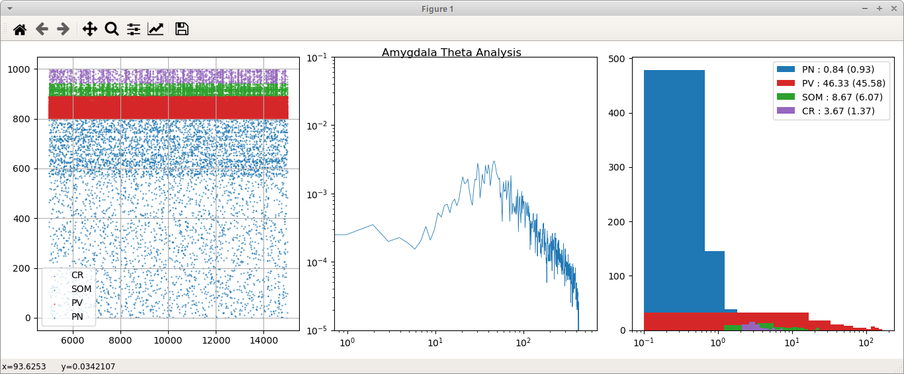

# Amygdala Theta
#### Code by Tyler Banks and Matthew Stroud. In partnership with Unal Lab (Tuna and Unal)
Modeling Basal Forebrain GABAergic Neuromodulation of the Amygdala Theta Rhythm


## Running the Model

### 1. Build network input files :

| Input file                    | Purpose | Generating code |
|-------------------------------|---------|-----------------|
| **`thalamus_pyr_spikes.h5`**         | Thalamic 2Hz poisson input to Pyramidal A and C cells | [`build_input.py`](./build_input.py)|
| **`thalamus_som_spikes.h5`**         | Thalamic 2Hz poisson input to SOM cells| [`build_input.py`](./build_input.py)|
| **`thalamus_cr_spikes.h5`**         | Thalamic 2Hz poisson input CR+ cells| [`build_input.py`](./build_input.py)|
| `vpsi_inh_spikes_nonrhythmic.h5`         | VPSI poisson input to PN A and C for non-rhythmic inhibition | [`build_input.py`](./build_input.py)|
| `shell_spikes.h5`   | Edge effects shell spikes | [`build_input_shell.py`](./build_input_shell.py)|
| **`vpsi_inh_spikes.h5`**         | VPSI 8Hz Rhythmic 3Hz poisson input to PN A and C | [`matlab/generatethetainputs.m`](./matlab/generatethetainputs.m) & [`matlab/convert_spikesmatrix.py`](matlab/convert_spikesmatrix.py)|

(primary files **bold**)

To generate the above files create Thalamic and VSPI inputs using the following. **If you change the scale you will need to re-run this with the correct scale variable set!**
```
python build_input.py

```

To generate 8Hz rhythmic inputs (based on Fink et al 2015). Repository comes with this file so, following these
steps isn't completely necessary. If you want to edit the parameters or rate at which the rhythmic inhibition
is presented, run the following: **If you change the scale you will need to re-run this with the correct scale variable set!**
```
matlab &
generatethetainputs
```
The files will then need to be converted to the Sonata format BMTK understands.
```
python matlab/convert_spikematrix.py
```

Once these steps have been completed, input files **WILL NOT** need to be regenerated again.

### 2. Build network configuration files

Building of the network can be customized by altering `build_network.py` configuration at the beginning of the script.

To generate necessary network specification files in the `[network](./network)` directory, execute

```
python build_network.py
```

If you have a shell of cells to deal with edge effects then the `shell_spikes.h5` file will be re-generated.

To generate a **homogenous** network then run

```
python build_network.py homogenous
```

### 3. Execute run script

The network can be tested using any one of the simulation configuration files listed below (`python run_network.py [configuration file]`)

| Configuration file | Input Details |Notes|
|--------------------|---------------|-----|
| [simulation_config.json](./simulation_config.json) | Thalamic 2Hz to PN, INT, SOM, CR, VPSI 2Hz exc and 8Hz inh to PN/INT | **deprecated** example |
| [simulation_configECP.json](./simulation_configECP.json) | Thalamic 2Hz to PN, SOM, CR, VPSI 2Hz exc and 8Hz inh to PN/INT | **deprecated** example with LFP recording electrodes [linear_electrode.csv](components/recXelectrodes/linear_electrode.csv)|
| **[simulation_configECP_base.json](./simulation_configECP_base.json)** | Thalamic 2Hz to PN, SOM, CR | Quiet-waking state, baseline configuration file |
| **[simulation_configECP_base_edge_effects.json](./simulation_configECP_base_edge_effects.json)** | Thalamic 2Hz to PN, SOM, CR | Quiet-waking state, baseline configuration file **WITH EDGE EFFECT spikes presented** |
| [simulation_configECP_base_vclamp.json](./simulation_configECP_base_vclamp.json) | Thalamic 2Hz to PN, SOM, CR | Same as [simulation_configECP_base.json](./simulation_configECP_base.json), 11 voltage clamped PN cells, igaba from SOM+ synapses are recorded and placed in `outputECP/syn_report.h5` - Analysis completed using [ipsc_analysis.m](./matlab/ipsc_analysis.m) notes below |
| [simulation_configECP_gamma.json](./simulation_configECP_gamma.json) | | Gamma testing for original model replicated from Feng et al 2019|
| **[simulation_configECP_vpsi.json](./simulation_configECP_vpsi.json)** | Thalamic 2Hz to PN, SOM, CR, VPSI 8Hz rhythmic inh to PN/INT | Primary VPSP input test|
| **[simulation_configECP_vpsi_edge_effects.json](./simulation_configECP_vpsi_edge_effects.json)** | Thalamic 2Hz to PN, SOM, CR, VPSI 8Hz rhythmic inh to PN/INT | Primary VPSP input test **WITH EDGE EFFECT spikes presented**|
| [simulation_configECP_vpsi_vclamp.json](./simulation_configECP_vpsi_vclamp.json) | Thalamic 2Hz to PN, SOM, CR, VPSI 8Hz rhythmic inh to PN/INT | Same as [simulation_configECP_vpsi.json](./simulation_configECP_vpsi.json), 11 voltage clamped PN cells, igaba from SOM+ synapses are recorded and placed in `outputECP/syn_report.h5` - Analysis completed using [ipsc_analysis.m](./matlab/ipsc_analysis.m) notes below
| [simulation_configECP_vpsi_vclamp_nonrhythmic.json](./simulation_configECP_vpsi_vclamp_nonrhythmic.json) | Thalamic 2Hz to PN, SOM, CR, VPSI 3Hz Poisson inh to PN/INT | Testing Non-rhythmic inhibition to PN/PV|
| **[simulation_configECP_base_homogenous.json](./simulation_configECP_base_homogenous.json)** | Thalamic 2Hz to PN, SOM, CR | Quiet-waking state, baseline configuration file for **HOMOGENOUS** network|
| **[simulation_configECP_vpsi_homogenous.json](./simulation_configECP_vpsi_homogenous.json)** | Thalamic 2Hz to PN, SOM, CR, VPSI 8Hz rhythmic inh to PN/INT | Primary VPSP input test for **HOMOGENOUS** network|


Primary tests **bold**

#### Single Core Mode
1000 Cell models typically run for **4-6 hours** on a single core.

```
python run_network.py simulation_configECP_base_edge_effects.json
```

#### Parallel Mode
1000 Cell models run for **5-6 minutes** on ~50 cores.
```
mpirun -n 50 nrniv -mpi -python run_network.py simulation_configECP_base_edge_effects.json
```

#### Theta Test
```
mpirun -n 50 nrniv -mpi -python run_network.py simulation_configECP_vpsi_edge_effects.json
```

#### Homogenous Tests (Base and VPSI)
```
mpirun -n 50 nrniv -mpi -python run_network.py simulation_configECP_base_homogenous.json
mpirun -n 50 nrniv -mpi -python run_network.py simulation_configECP_vpsi_homogenous.json
```

### Analysis of the model

Analysis of the model is primarily comprised of a spike raster, mean firing rates, raw LFP, and LFP PSD. Launch using:
```
python analysis.py
```


To simply get **firing rates** for quick analysis run
```
python analysis.py --no-plots

loading outputECP/spikes.h5
done
Type : mean (std)
PN : 0.84 (0.93)
PV : 46.33 (45.58)
SOM : 8.67 (6.07)
CR : 3.67 (1.37)
```

#### [analysis.m](./matlab/analysis.m)

**NOT RECOMMENDED** (slow on remote servers)

Plots can also be generated in MATLAB. A spike raster, mean firing rates, LFP and LFP PSD on 4 separate graphs.
```
analysis('../outputECP/ecp.h5','../outputECP/spikes.h5');
```


#### [ipsc_analysis.m](./matlab/ipsc_analysis.m)

Used in conjuction with [simulation_configECP_base_vclamp.json](./simulation_configECP_base_vclamp.json) and [simulation_configECP_vpsi_vclamp.json](./simulation_configECP_vpsi_vclamp.json) to sum igaba currents and perform a PSD to produce the raw signal and PSD plots. 
```
ipsc_analysis('../outputECP/syn_report.h5';
```

*Note: use `get_som2pn_targets.py` to determine the correct PN cells to set in `node_sets.json` prior to running the simulation.*

#### [connection_info.py](./connection_info.py)

Used to print the connectivity between cell types.

```
> python connection_info.py
        total uni   bi
PN->PN	2.0	  1.96	0.04
PN->PV	26.82	11.24	15.58
PN->SOM	31.19	29.17	2.01
PN->CR	18.43	16.41	2.02
PV->PN	52.0	36.42	15.58
PV->PV	22.92	17.41	5.5
PV->SOM	55.8	 55.8	  0.0
PV->CR	0.0	  0.0	  0.0
SOM->PN	6.57	4.55	2.01
SOM->PV	0.0	  0.0	  0.0
SOM->SOM	0.0	0.0	  0.0
SOM->CR	0.0   0.0   0.0
CR->PN	11.59	9.57	2.02
CR->PV	29.7	29.7	0.0
CR->SOM	75.25	75.25	0.0
CR->CR	0.0	  0.0	  0.0
```

### Other important files

| File/Directory | Description |
|------|-------------|
|[connectors.py](./connectors.py)|This is where you should define all connection rules - keeps build_network.py clean |
|[synapses.py](./synapses.py)| When adding new synapse types to be used by `build_network.py` they must be defined here |
|[components/templates/feng.hoc](./components/templates/feng.hoc)| Contains the PN A, PN C and INT hoc cell templates|
|[components/templates/SOM.hoc](./components/templates/SOM.hoc)| Contains the SOM and CR hoc cell templates|
|[components/synaptic_models](./components/synaptic_models)| Contains parameter configuration files for synapses used |
|[components/mechanisms/modfiles](./components/mechanisms/modfiles)| `.mod` definition files for cells and synapses|
|[tuning/current_clamp](./tuning/current_clamp)| Directory of easy to use hoc-based testers/tuners to simulate current injection into cells in the model


## Connectivity Matrix
* \+ : Excitatory
* \- : Inhibitory
* \+/\- : Both

| Source/Target  | Pyr | PV+ | SOM+ | CR+ |
|----------------|-----|-----|------|-----|
| Pyr            | +   | +   | +    | +   |
| PV+            | -   | -   | -    |     |
| SOM+           | -   |     |      |     |
| CR+            | -   | -   | -    |     |
| Thalamic Input | +   |     | +    | +   |
| VP/SI Input    | -   | -   |      |     |

Note: current model has no connection between PV to SOM.

## Tuning synaptic weights 
For each connection, edit the mean and standard deviation of weights to adjust firing properties.

| Source|Target| Synapse JSON |
|-------|-------|--------------|
|PN|PN|[PN2PN_feng_min.json](components/synaptic_models/PN2PN_feng_min.json)|
|PN|PV|[PN2INT_feng_min.json](components/synaptic_models/PN2INT_feng_min.json)|
|PN|SOM|[PN2SOM_tyler.json](components/synaptic_models/PN2SOM_tyler.json)|
|PN|CR|[PN2CR_tyler.json](components/synaptic_models/PN2CR_tyler.json)|
|PV|PN|[INT2PN_feng_min.json](components/synaptic_models/INT2PN_feng_min.json)|
|PV|PV|[INT2INT_feng_min.json](components/synaptic_models/INT2INT_feng_min.json)|
|PV|SOM|[INT2SOM_tyler.json](components/synaptic_models/INT2SOM_tyler.json)|
|SOM|PN|[SOM2PN_tyler.json](components/synaptic_models/SOM2PN_tyler.json)|
|CR|PN|[CR2PN_tyler.json](components/synaptic_models/CR2PN_tyler.json)|
|CR|PV|[CR2INT_tyler.json](components/synaptic_models/CR2INT_tyler.json)|
|CR|SOM|[CR2SOM_tyler.json](components/synaptic_models/CR2SOM_tyler.json)|
|Thalamic | PN|[BG2PNe_thalamus_min.json](components/synaptic_models/BG2PNe_thalamus_min.json)|
|Thalamic | SOM|[BG2SOM_thalamus_min.json](components/synaptic_models/BG2SOM_thalamus_min.json)|
|Thalamic | CR|[BG2CR_thalamus_min.json](components/synaptic_models/BG2CR_thalamus_min.json)|


## Single Cell Profiling

Cell templates can be found in:
```
./components/templates/templates.hoc
./components/templates/SOM.hoc
```
Templates used are:
```
Cell_A
Cell_C
PVCell
SOM_Cell
CR_Cell
```

To tune individual cells, run
```
cd /tuning/current_clamp
nrngui Cell_A.hoc
nrngui Cell_C.hoc
nrngui PVCell.hoc
nrngui SOM_Cell.hoc
nrngui CR_Cell.hoc
```

To get fi curves for individual cells, run
```
bmtool util cell --template Cell_Af fi
bmtool util cell --template Cell_Cf fi
bmtool util cell --template InterneuronCellf fi
bmtool util cell --template SOM_Cell fi
bmtool util cell --template CR_Cell fi
```

## Network Profiling

### Plot Connection Totals
```
bmtool plot connection total
```

### Plot the connections for a single cell

This is useful for verifying that your connection rules are functioning propertly, especially if they're space dependent

```
python plot_conns.py
```


### BMTOOLS

*Version 0.2.1+*

Install BMTools by running

```
pip install bmtool
```

Help Examples:
```
bmtool --help
bmtool util --help
bmtool util cell --help
bmtool util cell fi --help
```

### BMTK

Built using [BMTK](https://github.com/AllenInstitute/bmtk) checkout 52fee and later. Parallel netcon recording was added 6/29/21.

```
git clone https://github.com/AllenInstitute/bmtk
cd bmtk
python setup.py develop
````


## Appendix

### Installing NEURON and BMTK

See [https://github.com/tjbanks/easy-nrn-install](https://github.com/tjbanks/easy-nrn-install)

## Tuning tutorial

To tune the model, several things must be in done in order.
1. [Tune individual cells](#single-cell-profiling)
2. [Build the network](#2-build-network-configuration-files)
3. [Ensure connectivity is correct](#connection_infopy)
4. [Run the network](#parallel-mode)
5. [Analyze the network](#analysis-of-the-model)

We want connectivity and base firing rates to match literature.
